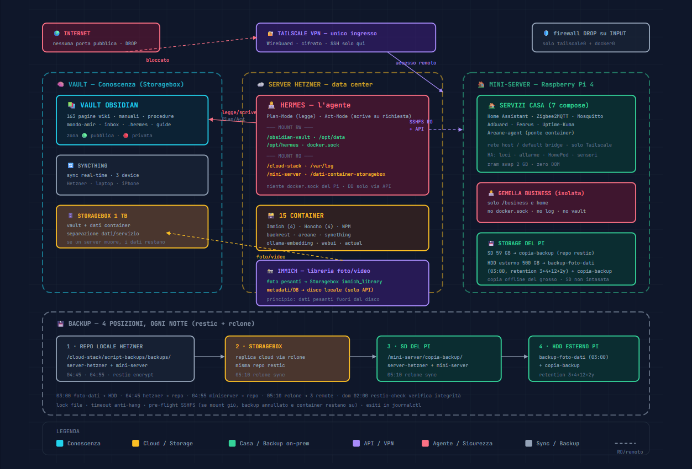

> **🌐 English version available: [README.md](README.md)**

---


# Come funziona il mio ecosistema: un vault, due server, un agente e quattro copie di backup

Il mio ecosistema personale è un homelab completo: una wiki Obsidian che funge
da memoria, un server Hetzner come data center, un Raspberry Pi come casa
domotica, e un agente AI (Hermes) che vive dentro il sistema e lo amministra.

Due server fisici, una ventina di container, una libreria foto su uno storage
dedicato e backup replicati in quattro posizioni. Tutto senza porte esposte su
Internet: i servizi ascoltano su reti interne e l'unico ingresso è una VPN.

Questo articolo descrive come funziona — la rete, i container, i mount,
il flusso dei dati, il backup e il ruolo dell'agente che coordina tutto.



> *Didascalia: come funziona l'ecosistema in un colpo d'occhio — in alto il perimetro di sicurezza (Internet bloccata, firewall DROP, Tailscale VPN come unico ingresso); al centro il server Hetzner con Hermes e i suoi mount RW/RO, i 15 container e il flusso Immich verso la Storagebox; a destra il mini-server con i servizi casa e gli storage del Pi (SD + HDD esterno); in basso la catena di backup notturna con le 4 posizioni (repo locale Hetzner → Storagebox, SD, HDD). Ogni colore indica una categoria: conoscenza, cloud/storage, casa/backup on-prem, API/VPN, agente/sicurezza, sync.*

---

## 1. La vista d'insieme

L'ecosistema è composto da tre livelli che si intrecciano:

```
┌────────────────────────────────────────────────────────────────────┐
│                        ECOSISTEMA                                  │
│                                                                    │
│   ┌──────────────┐    ┌──────────────┐    ┌──────────────────┐    │
│   │  Vault       │◄──►│  Hetzner     │◄──►│  Mini-server     │    │
│   │  (wiki)      │    │  (server)    │    │  (Raspberry Pi)  │    │
│   │  /obsidian-  │    │  /cloud-     │    │  /mini-server/   │    │
│   │  vault/      │    │  stack/      │    │  (smart home)    │    │
│   └──────┬───────┘    └──────┬───────┘    └────────┬─────────┘    │
│          │                   │                    │              │
│          └───────────────────┼────────────────────┘              │
│                              │                                    │
│                    ┌─────────▼─────────┐                         │
│                    │      Hermes       │                         │
│                    │   (agente AI)     │                         │
│                    │  workspace + tool │                         │
│                    └───────────────────┘                         │
└────────────────────────────────────────────────────────────────────┘
```

| Livello | Ruolo | Dove vive |
|---------|-------|-----------|
| **Vault** | Memoria persistente: wiki, manuali, procedure, carriera | Storagebox Hetzner, sincronizzato su 4 device |
| **Server Hetzner** | Data center personale: container, dati, automazioni | VPS (CX22, 4 core, 7.6 GB RAM + 4 GB swap) |
| **Mini-server** | Casa: smart home, DNS, monitoraggio, backup | Raspberry Pi 4 (ARM64, 3.7 GB RAM, zram) |
| **Hermes** | Agente AI che vive nel cloud, coordina e documenta | Container sul Hetzner |

Il principio architetturale è la **separazione dati/servizio**: la conoscenza
e i dati pesanti (foto, video) vivono su storage dedicati, non sui dischi dei
server. Così un guasto hardware non porta via i dati insieme al servizio.

---

## 2. La rete: come due server distanti lavorano come uno solo

### 2.1 Zero porte pubbliche: il firewall

Tutti i servizi ascoltano su porte locali o sulla rete Docker interna.
Il firewall del server Hetzner è in modalità **DROP su INPUT**: tutto è chiuso
per default, e sono autorizzate **solo** le interfacce `tailscale0` e `docker0`.

| Regola firewall | Effetto |
|-----------------|---------|
| Policy DROP su INPUT | Nessuna porta aperta di default |
| Solo `tailscale0` permessa | Unico ingresso: la VPN Tailscale |
| Solo `docker0` permessa | Le reti Docker interne funzionano |
| Nessuna porta su IP pubblico | Zero superficie di attacco esterna |
| SSH solo via Tailscale | Accesso remoto cifrato, mai su Internet |

L'accesso remoto avviene **sempre** tramite VPN (WireGuard): i container si
parlano tramite la rete Docker `casa_net` (per nome container), i due server
tramite Tailscale.

### 2.2 Le reti

| Rete | Tipo | Uso |
|------|------|-----|
| `casa_net` | Rete Docker interna (Hetzner) | I container si parlano per nome (Hermes ↔ Honcho ↔ NPM ↔ Immich...) |
| **Tailscale** | VPN WireGuard | Accesso remoto sicuro ai 2 server |
| **SSHFS** | Mount remoto | Il Hetzner monta la directory del Pi in sola lettura (`/mini-server/`) |
| **Syncthing** | Peer-to-peer | Sincronizza il vault su 4 device (Hetzner, laptop, 2 iPhone) |

Il mini-server **non usa** Syncthing: è raggiungibile dal Hetzner via SSHFS e
Tailscale. I suoi servizi (AdGuard, Fenrus, Uptime-Kuma, Home Assistant)
ascoltano su rete `host` o bridge default e sono raggiungibili via Tailscale.

---

## 3. I container: cosa gira dove

### 3.1 Server Hetzner — 15 container live

| Container | Ruolo |
|-----------|-------|
| **hermes** | L'agente principale (workspace + gateway API :8642) |
| **hermes-webui** | Interfaccia web dell'agente (:8787) |
| **istanza gemella (Elisa)** | Agente separato e isolato (nessun docker socket, nessun log sistema) |
| **nginx-proxy-manager** | Proxy inverso: instrada i servizi esposti su 127.0.0.1 |
| **syncthing** | Sincronizzazione vault (rete host) |
| **ollama-embedding** | Embedding locale per la memoria AI (nomic-embed-text) |
| **honcho** (4 container) | Memoria AI: API + deriver + PostgreSQL pgvector + Redis |
| **immich** (4 container) | Libreria foto/video: server + ML + Postgres + valkey |
| **backrest** | UI di gestione dei backup restic (:9898) |
| **arcane** | Pannello di gestione container (:3552), hub centrale |
| **actual-budget** | Gestione finanze (solo 127.0.0.1:5006) |

Alcuni dettagli notevoli:
- **NPM** è l'unico container con porte esposte su tutte le interfacce (80/443),
  ma instrada verso servizi su 127.0.0.1: non è un'esposizione, è il proxy interno.
- **L'istanza gemella (profilo separato)** è un'agente isolato con perimetro ridotto: non ha docker
  socket, non legge `/var/log/`, non accede a `/cloud-stack/`, `/mini-server/`
  o ai dati della Storagebox. Solo il suo vault e la sua home.
- **syncthing** è sull'unica rete host: non gli serve `casa_net`.

### 3.2 Mini-server — 7 servizi (compose attivi)

| Servizio | Ruolo | Rete |
|----------|-------|------|
| **Home Assistant** (+ Mosquitto + Zigbee2MQTT) | Domotica: luci, allarme, HomePod, sensori | host / default |
| **AdGuard Home** | DNS server, blocca pubblicità e tracker sulla LAN | host |
| **Fenrus** | Dashboard personalizzata (:3002) | default bridge |
| **Uptime-Kuma** | Monitoraggio uptime di entrambi i server (:3001) | default bridge |
| **Arcane-agent** | Ponte tra i container del Pi e l'hub Arcane sul Hetzner (:3553) | default bridge |
| **hermes-ai** | Gemello business dell'agente, isolato (:8642, su casa_net) | casa_net |

Il gemello business sul Pi ha accesso solo a `/business/` e alla sua home:
nessun docker socket, nessun log di sistema, nessun vault. Isolamento
volontario per separare il dominio personale da quello business.

---

## 4. I mount del container Hermes: cosa vede l'agente

L'agente non ha un accesso "tutto o niente": ha una **mappa dei mount**
definita nel docker-compose. Ogni area ha un permesso preciso.

```
hermes (container)
├── /obsidian-vault          RW   ← Storagebox (vault wiki, CWD)
├── /opt/data                RW   ← home (config, skills, memorie, sessioni)
├── /opt/hermes              RW   ← codice sorgente (volume condiviso)
├── /var/run/docker.sock     RW   ← gestione container del Hetzner
├── /mini-server             RO   ← directory del Pi via SSHFS
├── /var/log                 RO   ← log di sistema del Hetzner
├── /cloud-stack             RO   ← infrastruttura del Hetzner (compose, dati)
└── /dati-container-storagebox  RO ← dati container (foto/video Immich) su Storagebox
```

| Mount | Accesso | Cosa può farci Hermes |
|-------|---------|-----------------------|
| `/obsidian-vault/` | RW | Leggere e scrivere il vault (con Plan/Act-Mode: solo su richiesta) |
| `/opt/data/` | RW | Home: configurazione, skill, memoria persistente |
| `/var/run/docker.sock` | RW | Gestire i container del Hetzner (log, start, stop, restart) |
| `/mini-server/` | RO | Leggere config, log e dati del Pi — **non** modificare |
| `/var/log/` | RO | Analizzare i log di sistema |
| `/cloud-stack/` | RO | Leggere compose e dati dell'infrastruttura Hetzner |
| `/dati-container-storagebox/` | RO | Leggere la libreria foto/video (dati pesanti) |

Vincoli importanti:
- Hermes **non ha** il docker socket del mini-server: può leggere i dati del
  Pi, ma non gestirne i container (un umano lo fa).
- Può **scrivere** solo in `/obsidian-vault/` e `/opt/data/`; tutto il resto
  è in sola lettura.
- I database PostgreSQL (Honcho, Immich) non sono accessibili direttamente:
  si interrogano **solo via API** sui container della rete `casa_net`.

### Il ciclo di interazione

Hermes opera su due modalità:
- **Plan-Mode** (default): legge, analizza, propone. Non scrive nulla.
- **Act-Mode** (solo su richiesta esplicita): esegue modifiche, con report.

Per orientarsi usa una gerarchia di contesto: `SOUL.md` (identità) →
`AGENTS.md` (regole operative) → `guide` (struttura) → `README` (dettaglio).
Quando deve operare su un dominio, legge prima la guida di quel dominio.

---

## 5. La conoscenza: il vault e la libreria foto

### 5.1 Il vault Obsidian

Il vault vive su **Storagebox** (`/obsidian-vault/vault/llm-wiki-amir/`) ed è
sincronizzato da Syncthing su 3 device: Hetzner, laptop, iPhone di Amir. Contiene:

| Zona | Contenuto | Privacy |
|------|-----------|---------|
| `mondo-amir/` | Manuali, carriera, pubblicazioni | 🔴🟡 |
| `llm-wiki/` | Wiki pubblica (163 pagine: entities + concepts + sources) | 🟢 |
| `inbox/` | Report, agenda, mail | 🔴🟡 |
| `.hermes/` | Script, skills, tmp | 🔴 |
| Guide | `vault-guide.md`, `hetzner-guide.md`, `mini-server-guide.md` | 🟢 |

Il vault è separato dai server: la conoscenza non dipende dall'hardware che la
ospita. È il principio di **separazione dati/servizio**.

### 5.2 Immich e la Storagebox: dove finiscono le foto pesanti

La libreria foto/video (Immich) è il caso emblematico di separazione dei dati:

```
Immich stack (4 container sul Hetzner)
│
├── Foto/video (dati pesanti) ──► /mnt/storagebox/dati_container/immich_library/
│       (Storagebox 1 TB, montata RO per Hermes come /dati-container-storagebox/)
│
└── Metadati/DB (dati piccoli) ──► /opt/cloud-stack/data/immich/postgres/
        (disco locale del Hetzner, NON leggibile direttamente → solo API)
```

`UPLOAD_LOCATION` punta a `/mnt/storagebox/dati_container/immich_library`.
La struttura della libreria:

```
immich_library/
├── library/admin/<anno>/<data-ISO>/   # Foto/video originali
├── upload/                             # Upload in attesa di elaborazione
├── thumbs/                             # Thumbnail/anteprime
├── encoded-video/                      # Video transcodificati
├── profile/                            # Foto profilo
└── backups/                            # Backup automatici del DB
```

Le foto stanno separate dal disco del server per un motivo semplice: la
libreria è **pesante**, i contenuti multimediali crescono in fretta e non
devono riempire un disco da 80 GB. La Storagebox da 1 TB è lo storage pensato
per il grosso. I metadati (l'archivio "leggero") restano sul disco veloce del
server.

---

## 6. Il backup: quattro posizioni, ogni notte

### 6.1 La strategia

Il sistema di backup è centralizzato sul server Hetzner e usa **restic**
(snapshot incrementali, deduplicati e crittografati) per creare i backup, e
**rclone** per replicarli. Ogni notte, in sequenza:

| Ora | Script | Cosa fa |
|-----|--------|---------|
| 03:00 | `script-dati-foto.sh` | Backup delle foto/dati container (dalla Storagebox) → **HDD esterno del Pi** |
| 04:45 | `script-hetzner.sh` | Backup di `/opt/cloud-stack` (stop/start pulito dei Docker) |
| 04:55 | `script-miniserver.sh` | Backup dei dati del mini-server via SSHFS |
| 05:10 | `script-sync-backup.sh` | rclone sync dei repository → **3 destinazioni remote** |
| Dom 02:00 | `script-restic-check.sh` | Verifica integrità dei repository restic |

### 6.2 Le quattro posizioni

Ogni repository restic esiste in **4 copie**:

| # | Posizione | Dove |
|---|-----------|------|
| 1 | **Repository locale** | `/opt/cloud-stack/script-backups/backups/` (disco del Hetzner) |
| 2 | **Storagebox** | Replica cloud via rclone |
| 3 | **SD del mini-server** | `/mini-server/copia-backup/` |
| 4 | **HDD esterno del mini-server** | `/mini-server/hdd-esterno/copia-backup/` |

I repository contenuti sono due:
- `server-hetzner/` — snapshot di `/opt/cloud-stack`
- `mini-server/` — snapshot dei dati del Pi (via SSHFS)

### 6.3 Il ruolo dell'HDD esterno del mini-server

L'HDD esterno da 500 GB (`/dev/sda1`) ha due funzioni complementari:

| Cartella | Cosa contiene |
|----------|---------------|
| `backup-foto-dati/` | **Backup dedicato delle foto/dati container** (script 03:00, restic, retention 3+4+12+2y) |
| `copia-backup/` | Repliche dei repository restic (server-hetzner + mini-server) |

È la copia "offline" del grosso: la libreria foto (la parte più voluminosa)
viene replicata sull'HDD, che non è il disco di sistema del Pi e non tocca la
SD da 59 GB. Nessun file pesante occupa spazio su SD o sul disco del Hetzner.

### 6.4 Retention e verifica

| Repository | Retention |
|------------|-----------|
| server-hetzner / mini-server | 7 daily + 4 weekly + 6 monthly (--prune) |
| foto-dati | 3 daily + 4 weekly + 12 monthly + 2 yearly |

Gli script usano lock file per evitare esecuzioni concorrenti, un `timeout`
anti-hang, e `docker stop --timeout 600` per fermare i container in modo
pulito. Lo script del mini-server ha un **pre-flight check sul mount SSHFS**:
se il mount non risponde, il backup viene annullato e i container non vengono
fermati. Gli esiti finiscono in `journalctl` con tag dedicati
(`backup-hetzner`, `backup-sync-rclone`, `backup-dati-foto`, `restic-check`...).

---

## 7. Le operazioni periodiche: i cron di Hermes

L'agente non è solo on-demand: ha un sistema di automazioni periodiche che
ogni notte e ogni settimana tengono vivo l'ecosistema.

### 7.1 I cron di Hermes (sul Hetzner)

| Job | Orario | Funzione |
|-----|--------|----------|
| **sync-cron-scripts** | 05:55 | Allinea gli script cron tra vault e home |
| **daily-check** | 06:00 | 6 fasi: sync manuali, sync pubblicazioni, indici, skill, server health |
| **daily-mail** | 06:30 | Triage email quotidiano (via Composio) |
| **daily-briefing** | 07:00 | Riepilogo mattutino (email, log, agenda) |
| **weekly-jobs** | Lun 03:00 | Monitoraggio offerte LinkedIn |
| **Lint wiki** | Dom 11:00 | Verifica e rifinisce la wiki (broken link, orfani, tag) |
| **curriculum-knowledge-update** | Bimensile | Analisi manuali + mercato → report competenze |
| **Audit documentazione** | 1° mesi dispari (paused) | Confronta guide/README vs realtà (docker, mount, cron) |

In contesto CRON, Hermes opera in modo automatico e silenzioso: consegna i
report su Telegram/canali notifiche, senza interazione. Non usa Act-Mode in
cron: le modifiche richiedono sempre l'approvazione umana.

### 7.2 I cron di sistema (backup notturni)

Oltre ai job dell'agente, i cron di sistema eseguono i backup descritti in
§6.1 (03:00, 04:45, 04:55, 05:10, domenica 02:00) e gli health check
giornalieri che producono report con sezioni strutturare (informazioni
generali, risorse, temperature, SMART, kernel/OOM, SSH, log, Docker, backup,
aggiornamenti) e un blocco JSON machine-readable.

---

## 8. La sicurezza: il perimetro di Hermes

Il modello di sicurezza dell'ecosistema si riassume in pochi principi:

| Principio | Implementazione |
|-----------|-----------------|
| **Zero porte pubbliche** | Firewall DROP su INPUT; solo Tailscale + Docker |
| **Accesso remoto solo VPN** | SSH e servizi solo via Tailscale |
| **Permessi granulari** | L'agente scrive solo in `/obsidian-vault/` e `/opt/data/`; il resto è RO |
| **Dati sensibili fuori dal pubblico** | Zone 🔴 private (assets, profilo, .env) mai pubblicate |
| **Placeholder nei documenti pubblici** | IP `<...>`, credenziali `***` |
| **Script congelati** | Gli script di automazione non si modificano direttamente |

Il perimetro di Hermes è pensato per minimizzare il danno: può leggere (e
quindi analizzare) tutto, ma scrive solo dove deve. L'agente non decide mai
da solo di rompere qualcosa: Plan-Mode per analizzare, Act-Mode solo dopo
approvazione esplicita.

---

## 9. Lezioni e prossimi passi

### Lezioni

1. **Separare dati e servizio**: foto su Storagebox, config sul server,
   backup sull'HDD. Un guasto a un nodo non tocca i dati.
2. **L'agente con permessi granulari**: leggere ovunque, scrivere solo dove
   serve. È la ragione per cui può amministrare un'infrastruttura reale.
3. **Quattro copie, verifica settimanale**: il backup serve solo se sai che
   funziona, e il `restic check` domenicale lo garantisce.
4. **La documentazione è parte dell'infrastruttura**: guide e README sono
   consultati dall'agente prima di ogni operazione, e un audit periodico ne
   verifica l'allineamento con la realtà.
5. **Le skill come capitale operativo**: le competenze dell'agente sono
   modulari, versionate e validate, gestite da una skill dedicata che le
   controlla contro best practice.

### Prossimi passi

- Riattivare l'audit documentazione in modalità non sovrapposta
- Pubblicare le guide dell'ecosistema come serie su GitHub/LinkedIn
- Estendere il monitoraggio (temperature del Pi) ai KPI del briefing
- Esplorare l'automazione dei processi decisionali (roadmap delegate)

---

## Rischi residui

- **Single point of failure sul cloud**: se il VPS Hetzner muore, l'ecosistema
  "intellettuale" si ferma (la casa continua a vivere sul Pi). Mitigazione:
  4 copie di backup, ma il ripristino richiede tempo.
- **Mini-server in sola lettura dall'agente**: se serve un fix sul Pi, un
  umano deve applicarlo. Latenza accettabile, ma strutturare.
- **Privacy**: la wiki pubblica è gestita da un'API gratuita che trattiene i
  dati per training → i dati personali stanno altrove (zone 🔴).
- **Dipendenza da provider esterni**: modelli cloud, API, storage. Il sistema
  è decentralizzato ma non indipendente.

## Risorse / Collegamenti

- [Repository (in arrivo)]
- Articoli correlati: plugin wiki (pubblicato), docker-compose best practices (in lavorazione)

*Articolo descrittivo basato sulla documentazione viva dell'ecosistema:
vault-guide.md, hetzner-guide.md, mini-server-guide.md, Manuale Infrastruttura
generale, docker-compose reali e cron live.*
